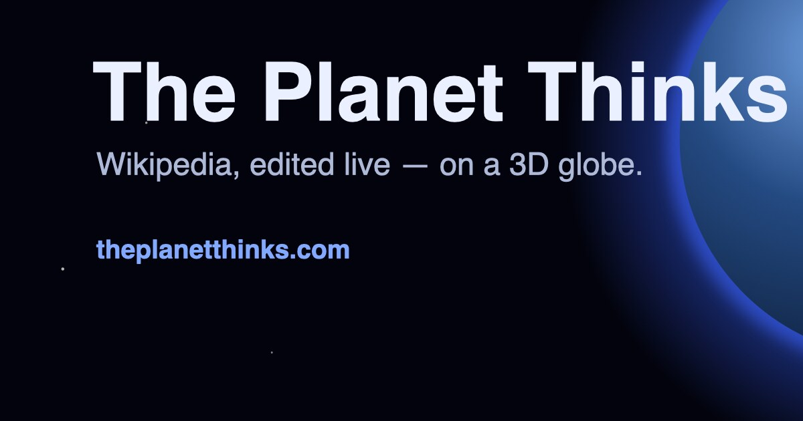

# The Planet Thinks

Watch Wikipedia being edited in real time on a 3D globe. Every pulse is a real edit
happening right now to an article about a place — the planet, visibly thinking.

**Live → [theplanetthinks.com](https://theplanetthinks.com)**



## How it works

- `server/` holds one connection to the
  [Wikimedia EventStreams](https://wikitech.wikimedia.org/wiki/Event_Platform/EventStreams)
  `recentchange` feed, keeps article edits from all ~300 language Wikipedias, resolves
  article coordinates (batched and cached), and fans the result out over WebSocket.
- `web/` renders the globe with [globe.gl](https://globe.gl) and three.js — a realistic
  day/night Earth, bloom, a drifting starfield, a cinematic auto-tour, optional chimes,
  and generative ambient music.

Edits light up where the **article subject** is located. Articles without coordinates
(people, ideas, eras — about 80% of Wikipedia) are counted in the header but not shown.
Editor IPs are never used; Wikipedia no longer exposes them.

## Develop

Requires Node ≥ 22.

```bash
npm install
npm run dev -w server   # ws://localhost:8080/ws
npm run dev -w web      # http://localhost:5173
npm test
```

The web client reads `VITE_WS_URL` to find the server, defaulting to the page's own
origin (`/ws`) which Vite proxies to `:8080` in development.

## Deploy

The static site runs on Cloudflare Pages; the WebSocket server runs on any small VPS
behind Cloudflare. Set `VITE_WS_URL` (or rely on the production default) to point the
client at the server.

## Credits

Globe textures are NASA imagery (Blue Marble day map and Black Marble night lights),
public domain.

## License

[MIT](LICENSE)
